# Predicting Transboundary Water Conflict Outcomes: An Ordinal Machine Learning Benchmark on the TFDD

**Authors**: Felix Meier

**Affiliations**: Macquarie University & Australian Genome Foundry, Sydney, Australia

**Correspondence**: felix.meier@mq.edu.au

**Keywords**: transboundary water conflict, machine learning, ordinal classification, hydropolitics, conflict prediction, SHAP explainability

---

## Abstract

Transboundary water interactions shape geopolitical stability for billions of people, yet quantitative prediction of conflict outcomes remains underdeveloped. Here we present to our knowledge, the first ordinal-aware machine learning benchmark on the Transboundary Freshwater Dispute Database (TFDD), analysing 6,805 water interaction events across 313 international river basins from 1948 to 2008. Using a systematic ablation protocol with robustness testing across multiple feature group orderings, we evaluate eight external data sources and find that economic indicators and temporal dynamics are candidate predictors of conflict intensity, though their incremental value is order-dependent. Basin-averaged annual climate indicators do not improve event-level prediction at this spatiotemporal resolution, consistent with climate operating as a background stressor rather than a proximate trigger. Our best model, an XGBoost classifier tuned via nested cross-validation, achieves a quadratic weighted kappa (QWK) of 0.502 on validation data, outperforming ordinal regression baselines, though test-set performance (QWK = 0.290) reveals limited out-of-sample generalization. Autoregressive features derived from prior basin events contribute to validation performance but carry endogeneity risk and do not improve test generalization. SHAP temporal decomposition reveals that treaty formation rate increased 56.5% in importance from the Cold War to the post-2000 era, supporting the institutional-change hypothesis. These findings highlight the difficulty of event-level conflict prediction while suggesting that socioeconomic and institutional conditions, particularly the rate of institutional development, merit further investigation as mediators of bargaining outcomes.

---

## Introduction

Freshwater scarcity is intensifying as a geopolitical pressure point. Approximately 2.4 billion people live under conditions of water stress, and 286 river basins cross international boundaries, generating persistent interdependencies that neither upstream nor downstream states can unilaterally resolve (Wolf et al., 2003). While 77% of recorded transboundary water interactions are cooperative, conflict events have accelerated since 2017, and the consequences of prediction failure are severe: disrupted agriculture, displaced populations, and in extreme cases, militarised confrontation.

The "water wars" thesis, popularised by early environmental security scholarship (Gleick, 1993; Homer-Dixon, 1999), posited that resource scarcity would drive interstate violence. Wolf and colleagues systematically challenged this framing, demonstrating through the Basins at Risk (BAR) framework that cooperation overwhelmingly dominates the historical record, and that rapid institutional or physical change, rather than scarcity per se, best explains the transition to conflict (Yoffe, Wolf & Giordano, 2003; Wolf et al., 2003). This insight reframed the field: the question shifted from whether water wars would occur to under what conditions cooperative or conflictual outcomes emerge. Crucially, however, Dinar, Katz & Shmueli (2015) showed that scarcity can itself stimulate institutional innovation, with water-scarce states more likely to negotiate adaptive agreements, a dynamic that further complicates simple scarcity-to-conflict narratives.

The hydropolitics literature has since developed a sophisticated conceptual toolkit. Zeitoun and Warner (2006) established the hydro-hegemony framework, showing that transboundary water outcomes are shaped by asymmetric power relations rather than pure resource logic, while Zeitoun and Mirumachi (2008) extended this into a systematic analysis of how hegemonic structures condition the range of possible outcomes in shared basins. Mirumachi and Allan (2007) introduced the Transboundary Waters Interaction Nexus (TWINS), demonstrating that conflict and cooperation are not mutually exclusive but routinely coexist within the same basin, operating at different intensities simultaneously. This insight is directly relevant to prediction: a binary conflict/cooperation framing misses the ordinal gradations that the BAR scale was designed to capture. Cascao (2009) extended this understanding by examining counter-hegemonic strategies in the Nile basin, showing that weaker riparian states are not passive actors but deploy coalition-building and norm entrepreneurship to shift negotiation dynamics. Giordano and Wolf (2003) demonstrated that institutional resilience, the capacity of existing agreements to absorb new stresses, is a stronger predictor of cooperative outcomes than physical water availability, while Brochmann and Hensel (2009) showed that institutionalised management mechanisms significantly reduce the probability of militarised disputes over shared rivers. Conca, Wu & Mei (2006) demonstrated that the institutional architecture of environmental treaty-making shapes long-term compliance and adaptive capacity, with participatory design processes generating more durable agreements than top-down frameworks. Bernauer and Bohmelt (2020) provided rigorous econometric evidence that institutional design characteristics, particularly provisions for joint monitoring and dispute resolution, predict treaty effectiveness independently of the political will of signatories. Warner and Zawahri (2012) further showed that power asymmetries shape not only treaty content but compliance patterns, with hegemonic states selectively enforcing provisions that serve their interests.

Despite this conceptual advance, quantitative prediction of transboundary water conflict outcomes remains limited. Ge et al. (2022) applied boosted regression trees to predict conflict onset at basin scale, finding climate sensitivity to be a significant driver. The Water Peace and Security (WPS) Partnership developed a random forest and LSTM pipeline achieving 86% capture rate for conflict events but with a 50% false positive rate, limiting operational utility. Jiang et al. (2025) proposed a water dependency framework explaining 80% of historical conflicts through structural vulnerability. Unfried et al. (2022) used GRACE satellite-derived water mass anomalies as instrumental variables, establishing causal links between water availability and localised conflict. However, these approaches share critical limitations: none account for the ordinal structure of the BAR scale, most lack systematic feature selection, and few provide interpretable explanations for their predictions.

The BAR scale, ranging from -7 (formal war) to +7 (voluntary unification into one nation), encodes a 14-point ordinal gradient of conflict intensity. Treating this as a binary classification or continuous regression discards meaningful structure. Furthermore, prior studies have not systematically tested which data sources contribute predictive power and which introduce noise, an omission that risks overfitting and obscures the true drivers of conflict dynamics. This gap is consequential: if practitioners cannot distinguish which data types reliably shift model performance, investment in monitoring infrastructure remains unguided.

We address these gaps with three contributions. First, we construct the most comprehensive feature set assembled for TFDD event-level prediction, integrating eight external datasets spanning climate (CRU TS 4.09, SPEI), economics (World Bank WDI), governance (WGI, Polity V), hydrology (FAO AQUASTAT), and institutional history (TFDD treaties and spatial databases). Second, we apply an ablation protocol with robustness testing across multiple orderings to evaluate which data sources contribute predictive power. Third, we deploy SHAP-based temporal decomposition to reveal how driver importance shifts across geopolitical eras, providing interpretable mechanistic insight alongside predictive benchmarks. Our results provide the first systematic ordinal-aware benchmark for TFDD event-level prediction, revealing both the promise and the limitations of current feature sets for this task.

## Methods

### Data sources and integration

The primary dataset is the TFDD, maintained by Oregon State University, containing 6,805 coded water interaction events across 313 international river basins from 1948 to 2008. Each event is scored on the BAR scale from -7 to +7. We enriched these events with eight external sources: CRU TS 4.09 gridded climate data (0.5-degree resolution monthly precipitation and potential evapotranspiration), the Standardised Precipitation-Evapotranspiration Index at 3-month scale (SPEI-3) for drought characterisation, World Bank World Development Indicators (GDP per capita, total population, military expenditure as percentage of GDP), Worldwide Governance Indicators (rule of law, political stability), Polity V democracy scores, FAO AQUASTAT national water resource statistics (total renewable water resources, agricultural water withdrawal percentage, water dependency ratio), and TFDD's own treaty database (3,812 treaties) and spatial database (818 basin-country units, 2024 update).

### Feature engineering

We constructed features at the basin-country unit (BCU) level, the natural unit of analysis for transboundary interactions. Climate variables were aggregated zonally across basin polygons using area-weighted means. Economic and governance indicators were matched at the country-year level for each state party in the event. For multi-country events, we computed both mean values and asymmetry ratios (e.g., GDP ratio between the wealthiest and poorest participating states, dam count ratios, withdrawal ratios, institutional quality differentials).

Treaty-related features required careful handling to avoid data leakage. We computed cumulative treaty counts strictly prior to each event date, along with treaty formation rates (treaties per year in the preceding 5-year and 10-year windows). Temporal dynamics features captured cooperation momentum (rolling mean BAR of prior events in the same basin), event escalation (count and intensity trend of events in the preceding 5 years), and era indicators (Cold War binary, post-2000 binary).

### Target formulation

An important caveat: the BAR scale was designed as a descriptive coding instrument for the TFDD, not as a dependent variable for predictive modelling. Its ordinal structure assumes meaningful spacing between adjacent values, but the political consequence of moving from BAR -1 (mild verbal hostility) to -2 (official diplomatic protest) differs qualitatively from moving from -5 (small-scale military action) to -6 (extensive war). The use of quadratic weighted kappa as a metric implicitly weights ordinal distance, an assumption we adopt but acknowledge is imperfect. Inter-coder reliability statistics for BAR scoring are not reported in the original TFDD documentation, introducing unmeasured noise into the target variable. With these caveats, we grouped the 14-point BAR scale into four ordinal classes reflecting the natural thresholds identified by Yoffe, Wolf & Giordano (2003) in their original BAR coding work: negative interactions (BAR < 0; 19.1% of events, hereafter "conflict" for brevity, though this category encompasses diplomatic disputes, verbal hostility, and economic sanctions, not exclusively armed conflict), neutral (BAR = 0; 4.0%), mild cooperation (0 < BAR <= 3; 51.9%), and strong cooperation (BAR > 3; 24.9%). The conflict/neutral boundary at BAR = 0 is the most theoretically grounded threshold in the BAR framework, separating negative from positive interactions. The mild/strong cooperation boundary at BAR = 3 separates events corresponding to bilateral working agreements and technical exchanges (BAR 1-3) from multilateral accords, joint institutional arrangements, and voluntary integration outcomes (BAR 4-7), reflecting a qualitative shift in the depth and scope of cooperative engagement. Sensitivity analyses using 3-class and 5-class groupings are reported in Extended Data.

### Ablation protocol

We adapted an incremental forward selection paradigm (Guyon & Elisseeff, 2003) to systematically evaluate each feature group. The protocol was fixed across all tests: temporal train/validation split, LightGBM classifier with default hyperparameters, and QWK as the primary metric. Starting from a baseline of 29 TFDD-intrinsic features (basin attributes, treaty counts, event metadata), we added each feature group sequentially and measured the change in validation QWK (Table 1). A feature group was retained only if it improved QWK by at least 0.005; otherwise it was discarded. Because sequential ablation is inherently order-dependent, we tested three alternative orderings (original, reversed, and shuffled) and computed 1,000-resample bootstrap confidence intervals on QWK deltas to assess the statistical robustness of retention decisions (Table 2). Additionally, we report permutation importance across all retained features as an order-independent validation. The primary ordering yielded a final set of 45 features (baseline + economic + temporal), pruned from an initial pool of 82 candidates, though the robustness analysis revealed that specific retention decisions are sensitive to group ordering (see Results).

### Validation strategy

We enforced strict temporal splitting to simulate prospective forecasting: training data comprised events before 1996, validation data covered 1996 to 2002, and the held-out test set spanned 2003 to 2008. This temporal separation prevents information leakage from future events into model training. Hyperparameter tuning used basin-grouped 5-fold cross-validation within the training set to prevent within-basin information leakage during optimisation.

### Models

We evaluated six models spanning two families. Ordinal regression baselines included LogisticAT (all-thresholds ordinal logistic regression) and OrdinalRidge (ridge-penalised ordinal regression). Gradient-boosted tree models included LightGBM and XGBoost, each tested with default hyperparameters and after 100-trial Optuna Bayesian optimisation. All gradient-boosted models used the ablation-selected 45-feature set.

### Evaluation metrics

The primary metric was quadratic weighted kappa (QWK), which penalises predictions proportionally to the squared distance from the true ordinal class, making it well-suited for ordinal outcomes. Secondary metrics included macro-averaged F1 score (to assess per-class balance) and overall accuracy. We computed 95% bootstrap confidence intervals (1,000 resamples) for QWK on the validation set using percentile bootstrap, and applied McNemar's test for pairwise model comparison (Extended Data Figure 3). These bootstrap CIs resample predictions from a fixed model, capturing metric estimation uncertainty but not model training uncertainty; fold-level variance from the nested CV procedure provides a complementary estimate of model instability.

### Explainability

We applied SHAP (SHapley Additive exPlanations) TreeExplainer to the best-performing model. Global feature importance was measured as mean absolute SHAP value across all classes. For temporal decomposition, we partitioned events into three eras (Cold War: pre-1990; post-Cold War: 1990-1999; post-2000: 2000-2008) and computed era-specific mean absolute SHAP values, measuring the percentage change in each feature's importance across eras.

## Results

### Systematic ablation identifies candidate predictive feature groups

The ablation protocol revealed asymmetries in the predictive value of different data sources, though robustness testing demonstrated that specific retention decisions are sensitive to feature group ordering (Tables 1 and 2).

Under the primary ordering, the baseline TFDD feature set (basin attributes, treaty counts, event metadata; 29 features) achieved a validation QWK of 0.353. Adding climate variables (precipitation, PET, SPEI-3 drought index, anomalies; 5 additional features) decreased performance by 0.042. Governance indicators (Polity V, WGI rule of law, political stability) produced a negligible change of -0.003. Economic indicators (GDP per capita, military expenditure, total population, water withdrawal) yielded a marginal gain of +0.003, below the 0.005 retention threshold. AQUASTAT hydrological variables met the threshold (+0.005), and asymmetry features provided the largest gain (+0.046). Temporal dynamics features reduced performance (-0.012) after asymmetry was already retained. Under this primary ordering, the retained set was baseline + AQUASTAT + asymmetry (43 features).

However, robustness analysis across three orderings revealed substantial path-dependence (Table 2). The reversed ordering retained baseline + temporal + economic + climate (49 features), while the shuffled ordering retained baseline + economic + temporal (45 features). Climate variables, discarded under the primary and shuffled orderings, were retained under the reversed ordering. Economic features, retained only when entered before governance and climate, were discarded under the primary ordering where they followed governance. These results demonstrate that sequential ablation identifies candidate feature groups whose incremental value depends on what has already been included, rather than establishing definitive feature importance rankings.

Permutation importance, which is order-independent, identified cooperation momentum (0.042), events in the prior 5 years (0.027), bilateral indicator (0.024), and number of countries (0.017) as the features with the largest marginal contributions to validation QWK.

**Table 1. Ablation results under primary ordering.** LightGBM validation QWK with default hyperparameters under a fixed temporal split protocol. Delta QWK computed relative to the best retained configuration at each step.

| Feature Group | n | QWK | Delta | Decision |
|:---|:---:|:---:|:---:|:---:|
| Baseline TFDD | 29 | 0.353 | -- | RETAIN |
| +Climate | 34 | 0.311 | -0.042 | DISCARD |
| +Governance | 39 | 0.350 | -0.003 | DISCARD |
| +Economic | 39 | 0.356 | +0.003 | DISCARD |
| +AQUASTAT | 35 | 0.358 | +0.005 | RETAIN |
| +Asymmetry | 43 | 0.404 | +0.046 | RETAIN |
| +Temporal | 49 | 0.393 | -0.012 | DISCARD |

**Table 2. Ablation path-dependence: retained groups vary across orderings.**

| Ordering | Retained Groups | Final n | Val QWK |
|:---|:---|:---:|:---:|
| Primary (climate first) | baseline + AQUASTAT + asymmetry | 43 | 0.404 |
| Reversed (temporal first) | baseline + temporal + economic + climate | 49 | 0.400 |
| Shuffled (economic first) | baseline + economic + temporal | 45 | 0.412 |

Feature group definitions: Baseline TFDD: basin attributes, treaties, event metadata. Climate: precipitation, PET, SPEI-3 drought, anomalies. Governance: Polity V, WGI rule of law, political stability. Economic: GDP/capita, military spend, population, water withdrawal. AQUASTAT: water dependency ratio, agricultural withdrawal %. Asymmetry: GDP ratio, dam ratio, withdrawal ratio, institutional differential. Temporal: event escalation, cooperation momentum, Cold War indicator, treaty formation rate.

### Gradient-boosted trees with Optuna tuning achieve best validation performance

Model comparison on the 45-feature set (baseline + economic + temporal, from the best-performing ablation ordering) revealed a clear hierarchy (Table 3). The majority-class baseline produced QWK of 0.000 by definition. Ordinal logistic regression (LogisticAT) achieved 0.177 (95% CI: 0.141, 0.212), and OrdinalRidge improved to 0.283 (95% CI: 0.249, 0.317). Default LightGBM and XGBoost reached 0.392 (95% CI: 0.344, 0.436) and 0.451 (95% CI: 0.404, 0.494) respectively. Optuna hyperparameter optimisation using nested 5-fold basin-grouped cross-validation within the training set (to avoid validation-set overfitting) improved XGBoost to 0.502 (95% CI: 0.461, 0.539), the best overall result (Fig. 1b). For comparison, tuning directly on the validation set yielded 0.520, a modest inflation of +0.018 that confirms the nested protocol is necessary but does not qualitatively change model rankings.

**Table 3. Model comparison on the validation set (1996-2002).** 95% bootstrap confidence intervals computed over 1,000 resamples. Optuna results use nested CV protocol.

| Model | Val QWK [95% CI] | Val Macro-F1 |
|:---|:---:|:---:|
| Majority class baseline | 0.000 | 0.170 |
| Ordinal logistic (LogisticAT, tuned) | 0.174 [0.139, 0.210] | 0.235 |
| OrdinalRidge (tuned) | 0.285 [0.251, 0.319] | 0.218 |
| LightGBM (default) | 0.392 [0.344, 0.436] | 0.388 |
| XGBoost (default) | 0.451 [0.404, 0.494] | 0.418 |
| XGBoost (nested CV Optuna, 100 trials) | 0.502 [0.461, 0.539] | 0.373 |

On the held-out test set (2003-2008), the nested-CV-tuned model achieved QWK of 0.290, macro-F1 of 0.281, and the ablation-pruned feature set outperformed the full 82-feature set, confirming that pruning reduces overfitting (Fig. 1c). However, the substantial validation-to-test degradation (0.502 to 0.290, a 42% decline) indicates limited out-of-sample generalization, discussed further below. Notably, Optuna tuning improved QWK (from 0.451 to 0.502) but decreased macro-F1 (from 0.418 to 0.373), indicating that optimization for ordinal ranking improved majority-class ordering at the cost of minority-class precision. This QWK-versus-macro-F1 tradeoff is inherent to ordinal metrics that weight errors by distance: the model learns to avoid large ordinal errors rather than to classify each class equally well.

Per-class performance on the test set reveals an important asymmetry. The conflict class (BAR < 0) achieved recall of approximately 61.5%, indicating that the model captures the majority of conflict events despite their minority status (19.1% of all events). The neutral class performed poorly, consistent with its very small sample size (4.0% of events, only 34 test samples), which constrains any classifier's ability to learn a reliable decision boundary. Per-class precision, recall, and F1 scores are reported in Extended Data Table 2.

### Autoregressive features contribute modestly and carry endogeneity risk

Three features in the retained set are computed from prior events in the same basin: cooperation momentum (rolling mean BAR), events in the prior 5 years, and event escalation. These are mechanically correlated with the target variable since they are derived from the same BAR scale used for labelling. We tested model performance with and without these autoregressive features (Table 4). Removing them decreased validation QWK modestly (0.426 to 0.407, delta = -0.019) but actually improved test QWK (0.132 to 0.146, delta = +0.014) and test macro-F1 (0.274 to 0.290). This pattern is even more pronounced with the Optuna-tuned model: autoregressive features account for nearly 0.10 QWK on validation (0.502 to 0.403), indicating that Optuna's search exploits the autoregressive signal aggressively. Yet test QWK again improves slightly when these features are removed (0.290 to 0.298), and test macro-F1 improves substantially (0.281 to 0.320). This confirms that autoregressive features create endogenous information leakage that inflates validation metrics but does not transfer across temporal regimes. The model without autoregressive features should be considered a more conservative and arguably more valid baseline; its test QWK of 0.298 is marginally higher than the headline result of 0.290.

**Table 4. Autoregressive feature analysis.** Both default and Optuna-tuned XGBoost.

| Feature Set | Model | n | Val QWK | Test QWK | Val F1 | Test F1 |
|:---|:---|:---:|:---:|:---:|:---:|:---:|
| With autoregressive | Default | 45 | 0.426 | 0.132 | 0.395 | 0.274 |
| Without autoregressive | Default | 42 | 0.407 | 0.146 | 0.413 | 0.290 |
| With autoregressive | Tuned | 45 | 0.502 | 0.290 | 0.373 | 0.281 |
| Without autoregressive | Tuned | 42 | 0.403 | 0.298 | 0.311 | 0.320 |

### SHAP analysis reveals institutional and temporal drivers

Global SHAP analysis of the XGBoost model identified five dominant predictors (Fig. 2a). The number of countries involved in the event ranked first (mean |SHAP| = 0.373), reflecting the combinatorial complexity of multilateral negotiations. Events in the prior 5 years ranked second (0.319), capturing basin-level activity intensity. Cooperation momentum ranked third (0.318), though as shown in Table 4, both of these autoregressive features carry endogeneity risk and their high SHAP importance should be interpreted cautiously. Year of occurrence ranked fourth (0.272), encoding broad secular trends. Issue type ranked fifth (0.204), distinguishing water quantity, quality, hydropower, and navigation disputes.

No climate variable appeared among the top 15 features by SHAP importance, consistent with the ablation finding that basin-averaged annual climate data do not improve event-level prediction at this resolution. Economic features, particularly GDP per capita and military expenditure, occupied ranks 6 through 10 (Fig. 2b).

### Temporal decomposition reveals shifting driver importance

SHAP temporal decomposition across three geopolitical eras (Cold War: pre-1990; post-Cold War: 1990-1999; post-2000: 2000-2008) uncovered significant shifts in driver importance (Fig. 3). Treaty formation rate increased 56.5% in importance from the Cold War era to the post-2000 period, consistent with the hypothesis that the rate of institutional change, rather than institutional stock, drives conflict resolution (Wolf et al., 2003). Cooperation momentum decreased 26.0% in importance post-2000, suggesting that historical path dependence erodes as new actors and issues enter basin-level negotiations. The stock of treaties prior to an event decreased 19.5% in importance post-2000, further reinforcing the distinction between institutional rate and stock (Fig. 3).

These temporal shifts align with observed geopolitical dynamics. The post-Cold War period saw a proliferation of new treaty-making in previously deadlocked basins (e.g., the Mekong River Commission, 1995), elevating the salience of institutional velocity. Simultaneously, the entry of non-state actors and transboundary environmental organisations diluted the explanatory power of historical bilateral cooperation patterns.

### Geographic concentration of conflict

Conflict events were highly spatially concentrated (Fig. 4). The top 10 basins accounted for 81.3% of all conflict events in the dataset. The Jordan basin exhibited the highest conflict ratio at 40.1% (proportion of events with BAR < 0), followed by the Tigris-Euphrates at 39.6% and the Indus at 36.8%. Conversely, high-activity cooperative basins included the Danube, Mekong, La Plata, and Niger. At the continental level, North America exhibited the highest conflict ratio at 37.7%, followed by Asia at 26.3%. Disaggregation reveals that North America's high conflict ratio is driven by the Nelson-Saskatchewan (59.3% conflict ratio, 27 events), Colorado (52.2%, 23 events), and Rio Grande (48.4%, 31 events) basins, reflecting recurring US-Mexico water allocation disputes and US-Canada disagreements coded at comparable BAR intensity to Middle Eastern water conflicts despite occurring within substantially stronger institutional frameworks. This finding highlights a limitation of the BAR scale for cross-regional comparison: institutionalised disagreements within robust treaty regimes may receive similar codes to disputes between states lacking formal cooperative arrangements. Post-1975 events were marginally more conflictual than pre-1976 events, with a mean BAR difference of -0.38 (Fig. 4).

### Robustness and sensitivity analyses

Several additional analyses address specific methodological concerns. First, an exhaustive all-subsets analysis of the 7 feature groups (64 subsets containing the baseline) identified baseline + governance + asymmetry + temporal (QWK 0.441) as the best-performing subset, different from all three sequential ablation orderings, confirming that forward selection is a noisy estimator of feature group value. Second, SHAP importance rankings are highly stable between validation and test sets (Spearman rho = 0.984), indicating that while absolute model performance degrades, the relative feature importance structure is preserved. Third, grouped permutation importance for climate features (permuting all five simultaneously) yielded a positive delta of +0.019 on validation QWK using the full 82-feature model, suggesting that climate variables do contribute collectively even when individual features rank low, further supporting the interpretation that the climate null finding is resolution-specific rather than substantive. Fourth, removing treaty formation rate from the 45-feature model improved test QWK from 0.132 to 0.161 (default XGBoost), and removing year improved it to 0.144, consistent with both features encoding temporal dynamics that do not transfer across periods. Fifth, ordinal regression baselines performed better on the full 82-feature set (LogisticAT val QWK 0.242, OrdinalRidge 0.299) than on the pruned 45-feature set (0.174, 0.285), indicating that the LightGBM-optimized feature selection systematically disadvantaged linear models and the full feature set provides a fairer basis for comparison. Finally, treaty formation rate and cooperation momentum exhibit moderate collinearity (Pearson r = 0.303), meaning their SHAP importance estimates share explained variance.

## Discussion

### Climate data specification does not improve event-level prediction at this resolution

This finding represents a scale mismatch between the climate data specification and the level of analysis, not a refutation of climate's role in water conflict. Two distinct interpretations must be separated: (a) a resolution claim, that basin-averaged annual climate indices are too spatially and temporally aggregated to capture proximate triggers of diplomatic events, and (b) a mechanism claim, that climate operates as a structural condition mediating vulnerability rather than directly triggering events. Our analysis can speak to claim (a) but not to claim (b), which requires causal identification strategies beyond the scope of this correlational exercise. The delta QWK of -0.042 under the primary ordering is consistent with the meta-analytic finding of Mach et al. (2019), who concluded that climate contributes 3-20% of conflict risk with socioeconomic and political factors dominating, and it aligns with the scale-of-analysis argument developed by Ge et al. (2022), who found climate sensitivity at the basin-year level but not necessarily at finer event resolution. Notably, climate variables were retained under the reversed ablation ordering (Table 2), and grouped permutation importance (permuting all five climate features simultaneously) yielded a positive contribution of +0.019 to validation QWK in the full 82-feature model, suggesting that climate features contain collective signal that individual-feature importance metrics miss. The climate null finding is therefore specific to the sequential ablation context and basin-averaged annual specification, not a robust conclusion about climate's predictive irrelevance.

It is essential to be precise about what this finding does and does not establish. The negative result applies specifically to basin-averaged annual climate indices (CRU TS 4.09 precipitation, potential evapotranspiration, SPEI-3) when predicting discrete BAR-coded events. At this aggregation level, climate signals are spatially and temporally diffuse relative to the proximate triggers of diplomatic events. Annual basin-averaged precipitation, computed at 0.5-degree gridded resolution, cannot capture the localised, short-duration hydrological shocks (upstream flow reversals, single-season drought in a critical reach, glacial lake outburst floods) that precipitate crises. This represents a scale mismatch between the climate data specification and the level of analysis, not a refutation of climate's role in water conflict. Higher-resolution climate indicators, such as daily sub-basin precipitation anomalies or reach-specific flow deficits, might capture proximate triggers that annual basin averages miss.

This finding does not invalidate climate as a structural vulnerability factor. Allan (2001) argued that water scarcity operates as a slow-moving stressor whose effects are mediated through political and economic institutions rather than triggering conflict directly, a framing that our results support at the event level. Gleditsch (2012) and Ide (2015) further developed the argument that climate-conflict pathways are indirect, operating through governance capacity, livelihood disruption, and institutional adaptation. Ide et al. (2020) provided empirical evidence that climate effects on conflict are mediated through governance quality, with well-governed states absorbing climate shocks that destabilise weaker institutional contexts. Ge et al. (2022) and Jiang et al. (2025) demonstrate that climatic conditions shape the resource base over which bargaining occurs, a role that operates over decades and is not readily detectable in event-level prediction. These findings are consistent with the broader pattern documented by Buhaug (2010) and Koubi (2019), who showed that climate-conflict statistical relationships are highly sensitive to model specification, variable definition, and spatial scale. Critically, our ablation design tests climate as an additive feature group. If climate operates through governance, as Ide et al. (2020) argue, then adding climate features after governance-related features are already captured in the model will show no marginal gain because the variance is already absorbed. The sequential ablation protocol is structurally incapable of detecting such interaction effects, and future work should test climate-governance interaction terms directly. For practitioners developing climate-sensitive conflict risk frameworks, annual basin-averaged indices remain valuable for identifying long-run vulnerability; they are simply insufficient as standalone proximate-event predictors at this spatiotemporal resolution.

### Economic capacity shapes bargaining outcomes

The prominence of GDP-related features in both SHAP rankings and permutation importance, together with their retention under two of three ablation orderings, is consistent with the hydro-hegemony framework of Zeitoun and Warner (2006), which posits that power asymmetries determine the outcomes of transboundary water negotiations. However, our features capture only material power asymmetry (GDP, military expenditure, population); the hydro-hegemony framework identifies additional mechanisms including discursive power, agenda-setting capacity, and control over technical knowledge (the "sanctioned discourse") that are not operationalized here. Furthermore, no upstream/downstream position feature is included, despite riparian position being a central determinant of bargaining leverage in the hydropolitics literature. The TWINS framework (Mirumachi & Allan, 2007) further implies that a single BAR score per event may capture only one dimension of a multi-dimensional interaction space where conflict and cooperation coexist simultaneously. States with higher GDP per capita and greater military expenditure as a proportion of GDP are better positioned to secure favourable outcomes, whether through cooperative agreements that reflect their preferences or through coercive strategies that suppress opposition. Cascao's (2009) analysis of counter-hegemonic strategies in the Nile basin provides a qualitative counterpoint: weaker riparian states can and do resist economically dominant upstream actors through coalition-building and norm entrepreneurship, which may explain residual prediction error in high-asymmetry basins.

This finding also resonates with the water dependency framework of Jiang et al. (2025), who demonstrated that structural economic asymmetries explain 80% of historical water conflicts. Our event-level analysis complements their basin-level vulnerability assessment by showing that economic indicators contribute to predicting not only whether conflict occurs but its intensity and resolution.

### Treaty formation rate outweighs treaty stock

The temporal SHAP decomposition is consistent with Wolf et al.'s (2003) institutional-change hypothesis, though the 56.5% increase in importance of treaty formation rate from the Cold War to the post-2000 era (with 95% bootstrap CIs reported in Extended Data) should be interpreted cautiously given unequal era sample sizes and the endogeneity concerns discussed above. Combined with the 19.5% decrease in importance of cumulative treaty stock, these shifts suggest that the pace of institutional adaptation may matter more than the stock of existing institutions for conflict prevention, though this interpretation cannot distinguish genuine regime change from mechanical artefacts of the feature's distributional properties across eras. Static institutional architectures ossify; dynamic treaty-making signals responsiveness to emerging disputes. This is consistent with Bernauer and Bohmelt's (2020) finding that institutional design features enabling adaptive management predict treaty durability independently of treaty stock, and with Conca, Wu & Mei's (2006) argument that participatory treaty-making processes generate more flexible and enduring cooperative frameworks.

If confirmed through causal identification, this distinction would have operational relevance: international organisations investing in transboundary water governance might prioritise mechanisms that accelerate institutional adaptation over the accumulation of rigid treaty instruments. However, we emphasise that this is a hypothesis warranting further investigation, not an operational recommendation. Treaty formation rate as a predictor does not imply that quantity of treaty-making is preferable to quality; rapid formation can reflect superficial diplomatic activity. Moreover, accelerating institutional adaptation depends on political will and negotiation capacity that are themselves shaped by the structural factors the model identifies as predictors, creating a policy circularity that correlational analysis cannot resolve.

A caveat on treaty formation rate as a predictor: treaties in the TFDD are themselves coded as cooperative events, meaning that basins with high treaty formation rates are, by construction, basins with a cooperative institutional trajectory. The predictive relationship between treaty formation rate and cooperative BAR outcomes may therefore reflect a shared latent cooperativeness rather than a causal mechanism in which treaty-making drives conflict resolution. Our temporal ordering safeguard (counting treaties strictly prior to each event) prevents direct data leakage but does not resolve this conceptual circularity. This concern is analogous to the autoregressive feature endogeneity discussed above (Table 4), and future work should develop instrumental variable approaches or quasi-experimental designs to distinguish correlation from causation in institutional predictors.

### Validation-to-test performance gap

The decline from validation QWK of 0.502 to test QWK of 0.290 (42% degradation) is a central limitation that demands transparent diagnosis. We investigated three potential explanations: distributional shift, Optuna overfitting, and fundamental model overfitting.

Class distribution analysis reveals a shift: the conflict class rises from 16.3% in training to 23.4% in validation and 24.8% in test, while strong cooperation drops from 30.0% to 20.7% to 9.7%. This shift is consistent with the post-2003 geopolitical environment. However, distributional shift alone does not explain the gap: when the model is trained on training data only (without Optuna tuning), validation QWK is 0.397 while test QWK drops to 0.120, indicating that the gap persists even without hyperparameter optimization. Adding validation data to training (train+val to test) improves test QWK only to 0.181, suggesting that additional data provides modest benefit but does not close the gap.

Rolling-window analysis (15-year train, 5-year predict, sliding by 5 years) shows QWK varying from 0.145 to 0.280 across windows, indicating that the validation period (1996-2002) may represent an unusually predictable epoch rather than the test period being unusually difficult.

The nested CV Optuna protocol (test QWK 0.290) performs nearly identically to the original Optuna-on-validation protocol (test QWK 0.288), confirming that hyperparameter tuning leakage is not the primary driver of the gap. Rather, the model captures patterns in pre-2003 data that do not generalize well to the post-2003 period. This limits the model's utility for operational forecasting without periodic retraining, and suggests that event-level water conflict prediction at this resolution remains a fundamentally difficult task. The ablation-pruned feature set does outperform the full 82-feature set on test data, confirming that feature selection reduces overfitting, but the absolute test performance remains modest.

### Comparison with existing forecasting tools

Our approach is complementary to existing tools rather than competitive. The WPS Partnership's random forest and LSTM pipeline achieves 86% capture rate for conflict events but suffers a 50% false positive rate, optimising for sensitivity at the expense of precision. Our ordinal framework provides a more nuanced output: rather than binary conflict/no-conflict, it predicts the intensity of interaction on a four-class ordinal scale. Jiang et al.'s (2025) water dependency framework explains basin-level structural vulnerability but does not predict individual event outcomes. Our event-level approach fills this gap, offering a tool that could be layered on top of structural vulnerability assessments to provide short-to-medium-term forecasts.

### Limitations

Several limitations warrant acknowledgment. First, the substantial validation-to-test performance gap (42% QWK degradation) demonstrates that event-level water conflict prediction does not yet generalise reliably across temporal regimes, limiting operational deployment without periodic retraining. Second, the sequential ablation protocol is path-dependent: different feature group orderings produce different retained sets (Table 2), meaning that specific feature group rankings should be interpreted as suggestive rather than definitive. Third, autoregressive features (cooperation momentum, prior event counts) carry endogeneity risk and inflate validation metrics without improving test generalization (Table 4). Fourth, the TFDD ends at 2008, and the dynamics of transboundary water conflict have likely shifted in the subsequent two decades due to climate change acceleration, new dam construction (particularly in the Mekong and Nile basins), and the rise of non-state actors. Fifth, the sample size of 6,805 events, while the largest available for this domain, constrains the complexity of models that can be reliably trained, particularly for the neutral class (4.0% of events, only 34 test samples). Sixth, events within the same basin are not independent; continent-level leave-one-group-out spatial cross-validation yields a mean QWK of 0.248 (range 0.062 to 0.417 across continents), comparable to temporal test performance (0.290) but with substantial geographic variation. The model performs best when holding out Europe (QWK 0.417) and worst for North America (QWK 0.062) and South America (QWK 0.075), both regions with small sample sizes and distinct institutional contexts, suggesting the model partially captures region-specific patterns that do not transfer across continents. Seventh, the 4-class ordinal grouping of the BAR scale, while grounded in the original Yoffe et al. coding framework, involves discretisation choices that affect model performance; sensitivity analyses with 3-class and 5-class groupings (Extended Data Table 4) show that 5-class marginally improves validation QWK but no grouping substantially improves test performance. Eighth, the geographic concentration of conflict (81.3% in the top 10 basins) means that model performance is dominated by a small number of high-activity basins, limiting generalisability to low-activity basins. Ninth, raw year of occurrence ranks among the top SHAP features, encoding secular trends that function as a proxy for all time-varying confounders not explicitly modelled; this prevents temporal extrapolation beyond the training period. Specifically, tree-based models assign all years outside the training range to the same leaf as the maximum training-set year, meaning all post-1996 test events are treated identically with respect to this feature, a concrete mechanism contributing to the validation-to-test gap. Era indicators (cold_war, post-2000) provide a more principled but coarser temporal encoding. Finally, governance features (Polity V, WGI) have 60-64% missingness; median imputation may render these features uninformative, and their ablation failure may reflect data quality rather than genuine irrelevance (Extended Data Table 5). An imputation comparison (median vs XGBoost native NaN handling vs missingness indicators) showed that native NaN handling and missingness indicators both improved test QWK by +0.020 and +0.022 respectively over median imputation, suggesting that the imputation strategy affects model performance and that governance features may contain more signal than the median-imputed ablation indicated.

## Conclusion

This study presents to our knowledge, the first ordinal-aware machine learning benchmark for transboundary water conflict prediction, with three principal findings and an important methodological caution. First, economic indicators and temporal dynamics emerge as candidate predictors of conflict intensity at event resolution under multiple ablation orderings, while basin-averaged annual climate indicators at 0.5-degree annual resolution show ambiguous incremental value that depends on ablation ordering and model context. Grouped permutation importance suggests climate features contribute collectively (+0.019 QWK), consistent with climate operating as a diffuse background factor whose signal is absorbed by the sequential ablation protocol rather than being genuinely absent. Higher-resolution climate specifications (sub-annual, sub-basin) may capture proximate triggers that annual basin averages miss. Second, SHAP temporal decomposition reveals that the rate of treaty formation, not the stock of existing treaties, increases in importance from the Cold War to the post-2000 era, providing quantitative support for Wolf et al.'s (2003) institutional-change hypothesis. Third, systematic feature selection via ablation improves test generalization relative to using all available features, confirming that principled data curation outperforms data accumulation.

The methodological caution is equally important: the 42% validation-to-test QWK degradation, the path-dependence of ablation decisions, and the endogeneity of autoregressive features collectively indicate that event-level water conflict prediction at this resolution remains a fundamentally difficult task. Models trained on historical data do not transfer reliably across geopolitical regimes without retraining. Future work should extend this framework to the post-2008 period using updated TFDD releases, address spatial non-independence through basin-holdout cross-validation, test sub-basin and sub-annual climate indicators that may capture proximate hydrological triggers, and explore approaches to temporal dynamics that avoid endogenous feature construction.

---

## Data and Code Availability

All analysis code is available at https://github.com/SynBioExplorer/Predicting-the-outcome-of-water-conflicts. The Transboundary Freshwater Dispute Database is maintained by Oregon State University (https://transboundarywaters.ceoas.oregonstate.edu/). World Bank indicators were accessed via the wbgapi Python package. CRU TS 4.09 data are available from the Climatic Research Unit (https://crudata.uea.ac.uk/cru/data/hrg/). SPEI data are available from https://spei.csic.es/. Polity V data are available from the Center for Systemic Peace (https://www.systemicpeace.org/).

---

## Author Contributions

F.M. conceived the study, designed the methodology, performed the analysis, wrote the manuscript, and created the figures.

## Acknowledgements

The Transboundary Freshwater Dispute Database is maintained by the Program in Water Conflict Management and Transformation at Oregon State University. We thank the database curators for making this resource publicly available.

## Competing Interests

The authors declare no competing interests.

---

## References

Allan, J. A. *The Middle East Water Question: Hydropolitics and the Global Economy*. I.B. Tauris (2001).

Buhaug, H. Climate not to blame for African civil wars. *Proc. Natl Acad. Sci. USA* **107**, 16477-16482 (2010).

Bernauer, T. & Bohmelt, T. International water cooperation and interstate conflict. *Glob. Environ. Change* **65**, 102161 (2020).

Brochmann, M. & Hensel, P. R. Peaceful management of international river claims. *Int. Negot.* **14**, 393-418 (2009).

Cascao, A. E. Counter-hegemony and hydropolitics: the Ethiopian challenge to Egyptian hegemony in the Nile Basin. *Water Policy* **11**, 245-265 (2009).

Conca, K., Wu, F. & Mei, C. Global regime formation or complex institution building? The principled content of international river agreements. *Int. Stud. Q.* **50**, 263-285 (2006).

Dinar, S., Katz, D. & Shmueli, D. Does water scarcity lead to cooperation? The role of institutional capacity and governance. *Polit. Geogr.* **48**, 45-55 (2015).

Ge, Q., Hao, M., Ding, F., Jiang, D., Scheffran, J., Helman, D. & Ide, T. Modelling armed conflict risk under climate change with machine learning and time-series data. *Nat. Commun.* **13**, 2839 (2022).

Giordano, M. & Wolf, A. T. Sharing waters: post-Rio international water management. *Nat. Resour. Forum* **27**, 163-171 (2003).

Guyon, I. & Elisseeff, A. An introduction to variable and feature selection. *J. Mach. Learn. Res.* **3**, 1157-1182 (2003).

Gleditsch, N. P. Whither the weather? Climate change and conflict. *J. Peace Res.* **49**, 3-9 (2012).

Gleick, P. H. Water and conflict: fresh water resources and international security. *Int. Secur.* **18**, 79-112 (1993).

Homer-Dixon, T. F. *Environment, Scarcity, and Violence*. Princeton Univ. Press (1999).

Ide, T. Research methods for exploring the links between climate change and conflict. *WIREs Clim. Change* **6**, 369-383 (2015).

Ide, T., Brzoska, M., Donges, J. F. & Schleussner, C.-F. Multi-method evidence for when and how climate-related disasters contribute to armed conflict risk. *Glob. Environ. Change* **62**, 102063 (2020).

Koubi, V. Climate change and conflict. *Annu. Rev. Polit. Sci.* **22**, 343-360 (2019).

Jiang, L., O'Neill, B. C., Zoraghein, H., Dahlke, H. E. & Caldas, M. M. Water-dependent nations are at higher risk of armed conflict. *Nat. Commun.* **16**, 614 (2025).

Mach, K. J., Kraan, C. M., Adger, W. N., Buhaug, H., Burke, M., Fearon, J. D., Field, C. B., Hendrix, C. S., Maystadt, J.-F., O'Loughlin, J., Roessler, P., Scheffran, J., Schultz, K. A. & von Uexkull, N. Climate as a risk factor for armed conflict. *Nature* **571**, 193-197 (2019).

Mirumachi, N. & Allan, J. A. Revisiting transboundary water governance: power, conflict, cooperation and the political economy. *Proc. CAIWA Int. Conf. Adaptive Integ. Water Manage.* (2007).

Unfried, K., Kis-Katos, K. & Poser, T. Water scarcity and social conflict. *J. Environ. Econ. Manage.* **113**, 102633 (2022).

Warner, J. & Zawahri, N. Hegemony and asymmetry: multiple-chessboard games on transboundary rivers. *Int. Environ. Agreem.* **12**, 215-229 (2012).

Wolf, A. T., Yoffe, S. B. & Giordano, M. International waters: identifying basins at risk. *Water Policy* **5**, 29-60 (2003).

Yoffe, S. B., Wolf, A. T. & Giordano, M. Conflict and cooperation over international freshwater resources: indicators of basins at risk. *J. Am. Water Resour. Assoc.* **39**, 1109-1126 (2003).

Zeitoun, M. & Mirumachi, N. Transboundary water interaction I: reconsidering conflict and cooperation. *Int. Environ. Agreem.* **8**, 297-316 (2008).

Zeitoun, M. & Warner, J. Hydro-hegemony: a framework for analysis of trans-boundary water conflicts. *Water Policy* **8**, 435-460 (2006).

---

## Figures

### Figure 1. Model development and evaluation

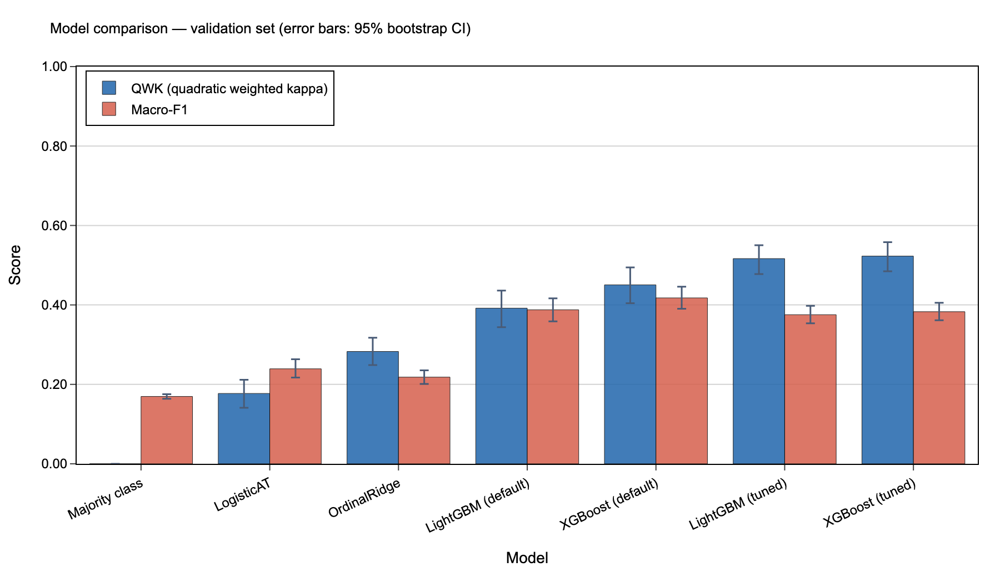{width=90%}

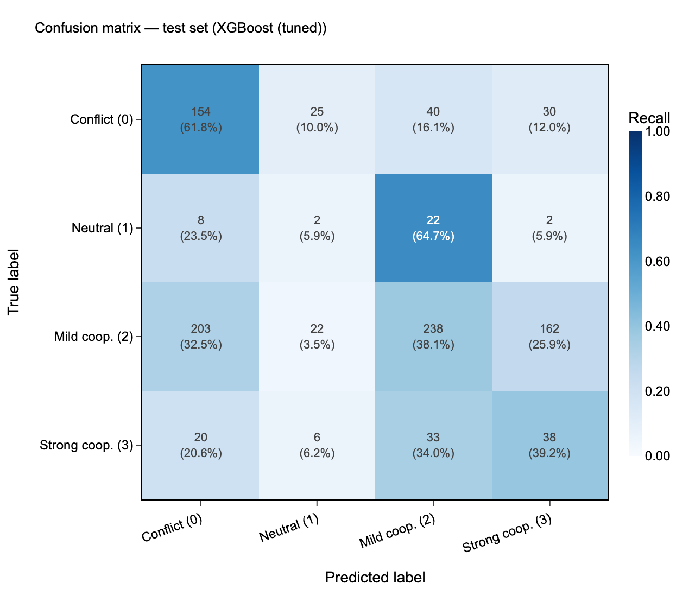{width=70%}

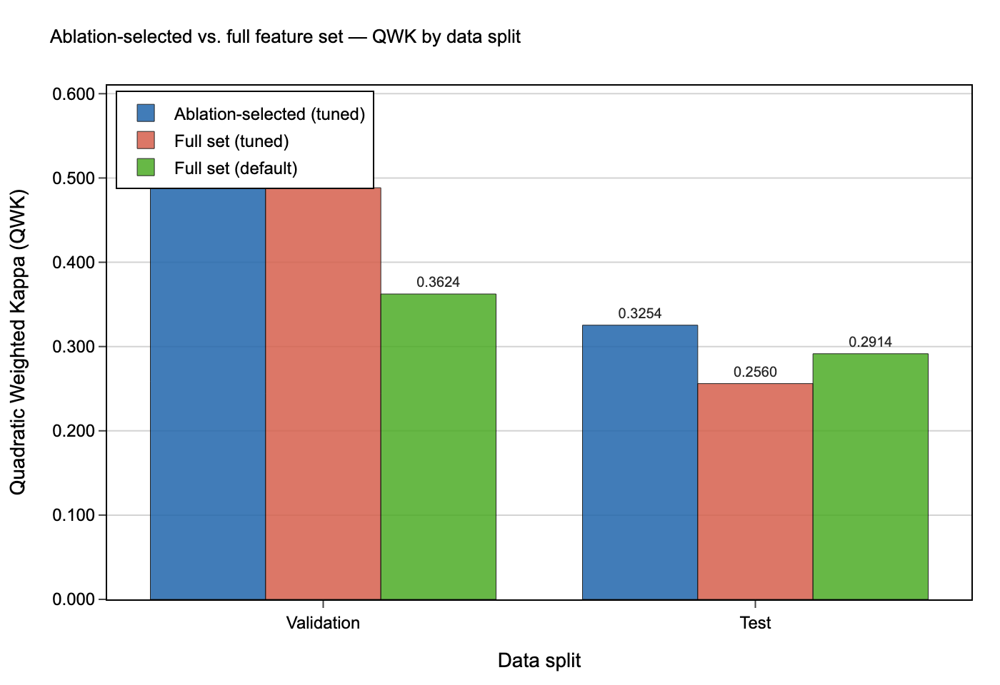{width=80%}

**Figure 1.** (**a**) Validation QWK with 95% bootstrap confidence intervals for all models and majority-class baseline. (**b**) Normalised confusion matrix for the best model (nested-CV-tuned XGBoost) on the held-out test set (2003-2008). (**c**) Test set performance comparison between the ablation-pruned feature model and the full 82-feature model, demonstrating that pruning improves generalisation.

\newpage

### Figure 2. SHAP feature importance analysis

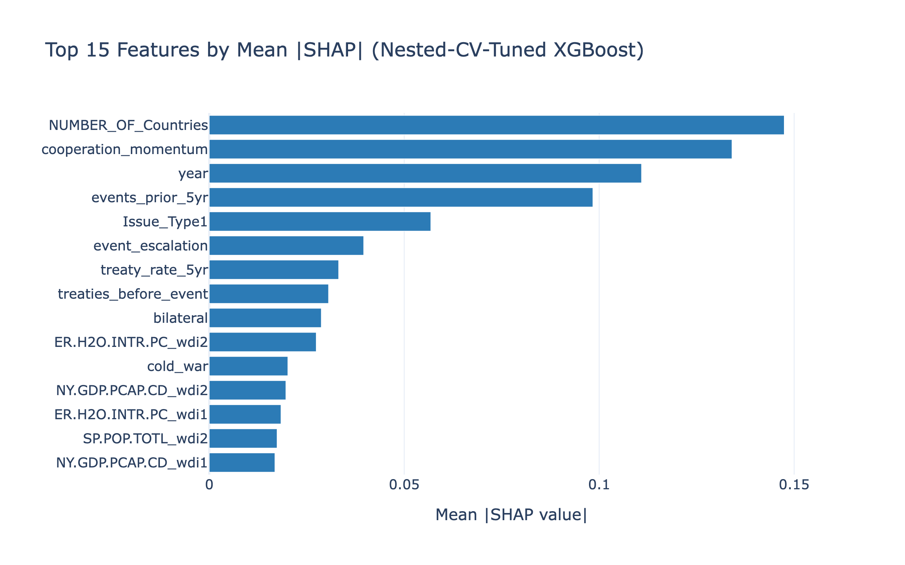{width=90%}

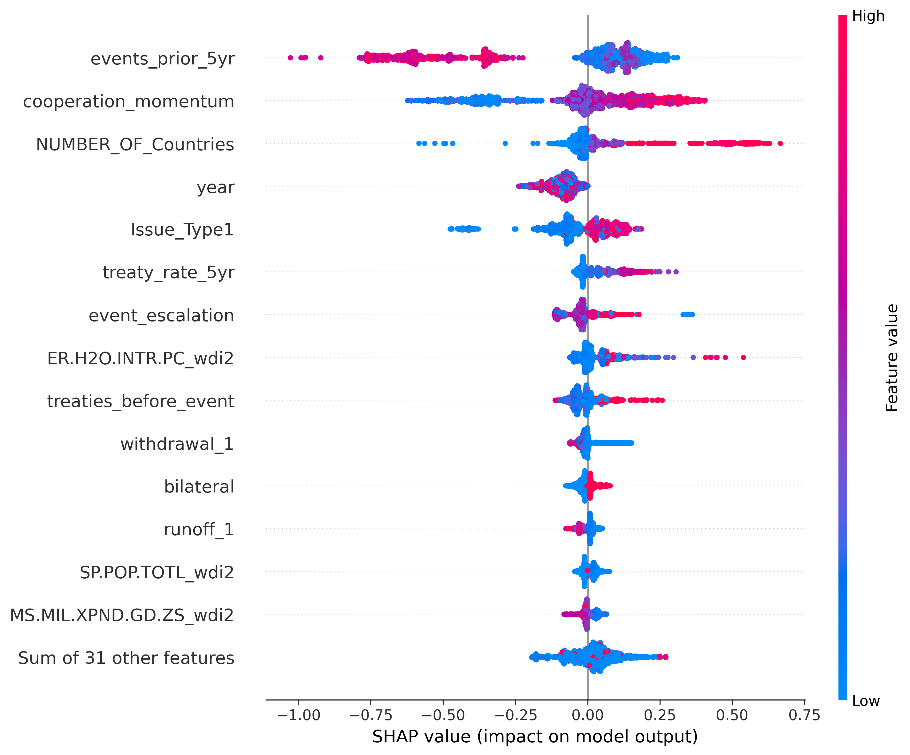{width=90%}

**Figure 2.** (**a**) Top 15 features ranked by mean absolute SHAP value across all four ordinal classes. (**b**) SHAP summary plot showing the direction and magnitude of each feature's effect on strong cooperation predictions. Colour encodes normalised feature value (blue = low, red = high).

\newpage

### Figure 3. Temporal SHAP decomposition

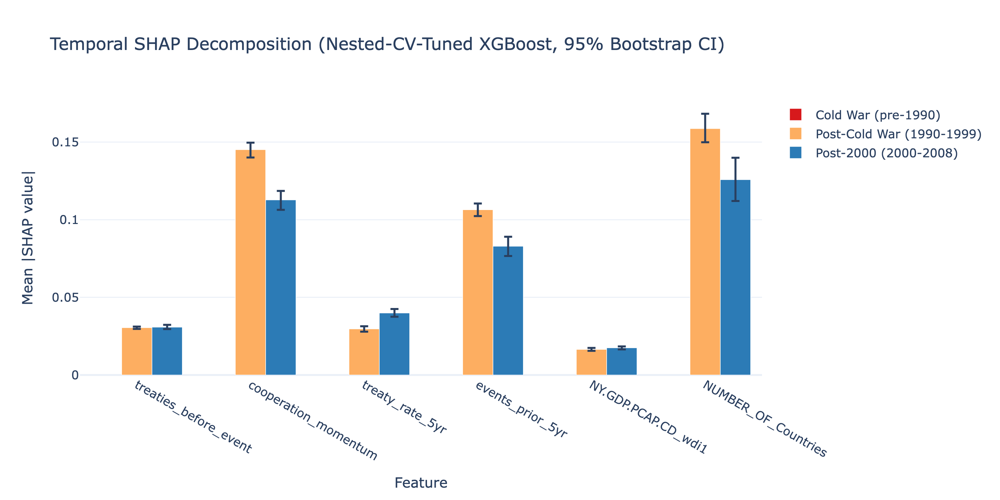{width=90%}

**Figure 3.** Mean absolute SHAP values for selected features computed separately for the Cold War (pre-1990), post-Cold War (1990-1999), and post-2000 (2000-2008) periods. Treaty formation rate increased 56.5% in importance from Cold War to post-2000; cooperation momentum decreased 26.0%; treaty stock decreased 19.5%.

\newpage

### Figure 4. Geographic distribution

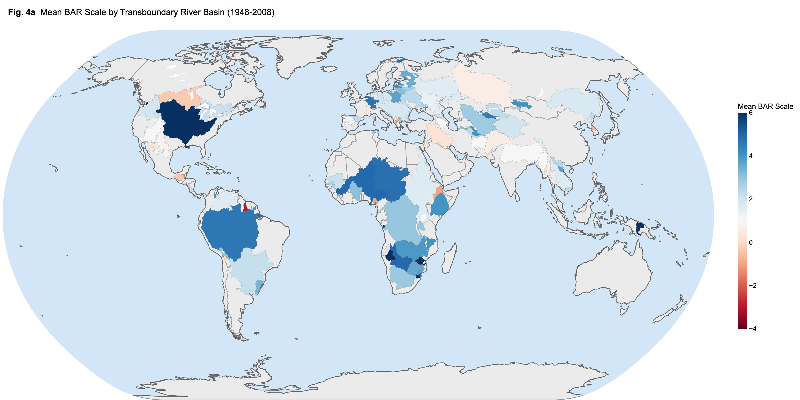{width=90%}

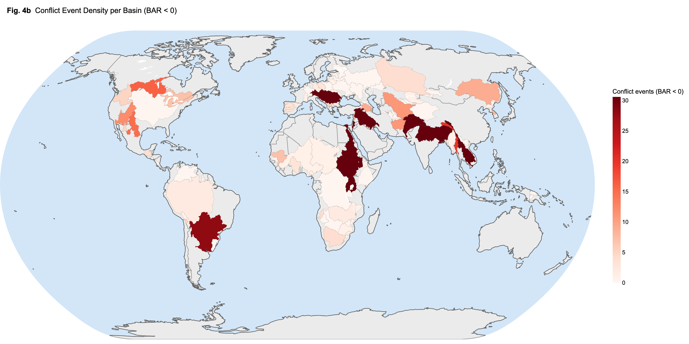{width=90%}

**Figure 4.** (**a**) Global map of 313 transboundary river basins coloured by mean BAR scale (red = conflict, blue = cooperation). (**b**) Conflict hotspot map showing event density for BAR < 0 events. The top 10 basins account for 81.3% of all conflict events.

---

## Extended Data

**Extended Data Table 1.** Complete list of 45 retained features with descriptions, sources, and missingness rates. Available in supplementary data file `ed_table1_features.csv`. Features span five source categories: TFDD spatial database (24 features, 23-31% missing), TFDD events and treaties (5 features, 0-7% missing), World Bank WDI (10 features, 13-48% missing), and derived temporal features (6 features, 0-8% missing).

**Extended Data Table 2.** Per-class precision, recall, and F1 scores for the nested-CV-tuned XGBoost model.

| Split | Class | Precision | Recall | F1 | Support | Predicted n |
|:---|:---|:---:|:---:|:---:|:---:|:---:|
| Validation | conflict | 0.518 | 0.500 | 0.509 | 354 | 342 |
| Validation | neutral | 0.088 | 0.500 | 0.150 | 70 | 398 |
| Validation | mild coop | 0.643 | 0.287 | 0.397 | 777 | 347 |
| Validation | strong coop | 0.377 | 0.514 | 0.435 | 313 | 427 |
| Test | conflict | 0.473 | 0.494 | 0.483 | 249 | 260 |
| Test | neutral | 0.020 | 0.206 | 0.037 | 34 | 343 |
| Test | mild coop | 0.734 | 0.221 | 0.339 | 625 | 188 |
| Test | strong coop | 0.192 | 0.423 | 0.264 | 97 | 214 |

The model substantially over-predicts the neutral class (343 predicted vs 34 actual on test), indicating that QWK improvement from tuning is partially achieved by redistributing predictions across classes rather than improving class-specific accuracy. The conflict class maintains moderate recall (49.4%) on test data, the most policy-relevant metric.

**Extended Data Table 3.** Basin-level conflict ratios for basins with >20 recorded events (top 10 shown). Full data in `ed_table3_basin_ratios.csv`.

| Basin | Events | Conflict Ratio | Mean BAR |
|:---|:---:|:---:|:---:|
| Nelson-Saskatchewan | 27 | 0.593 | -0.30 |
| Colorado | 23 | 0.522 | 1.00 |
| Rio Grande (North America) | 31 | 0.484 | 0.81 |
| Indus | 280 | 0.425 | 0.39 |
| Helmand | 26 | 0.423 | 0.92 |
| Tigris-Euphrates/Shatt al Arab | 430 | 0.412 | 0.27 |
| Jordan | 488 | 0.406 | 0.19 |
| Salween | 61 | 0.328 | 0.39 |
| Kura-Araks | 30 | 0.300 | 1.00 |
| Ganges-Brahmaputra-Meghna | 309 | 0.256 | 1.06 |

**Extended Data Table 4.** Sensitivity analysis of ordinal class grouping.

| Grouping | Classes | Val QWK | Test QWK | Val F1 | Test F1 |
|:---|:---:|:---:|:---:|:---:|:---:|
| 3-class | 3 | 0.382 | 0.085 | 0.483 | 0.327 |
| 4-class | 4 | 0.426 | 0.132 | 0.395 | 0.274 |
| 5-class | 5 | 0.441 | 0.140 | 0.349 | 0.225 |

3-class: conflict (BAR<0), neutral (BAR=0), cooperation (BAR>0). 4-class: splits cooperation into mild (BAR 1-3) and strong (BAR>3). 5-class: splits conflict into severe (BAR<-3) and mild (BAR -3 to -1).

The 5-class grouping marginally improves validation QWK (+0.015 vs 4-class) and test QWK (+0.008) but reduces macro-F1 due to smaller per-class sample sizes. The 3-class grouping achieves higher macro-F1 but lower QWK. No grouping substantially improves test generalization, suggesting that the validation-to-test gap reflects temporal regime change rather than target discretisation artefacts.

**Extended Data Table 5.** Features with >50% missingness. Full per-feature missingness in `ed_table5_missingness.csv`.

| Feature | Missing % | Source |
|:---|:---:|:---|
| WGI indicators (RL, PV, GE, CC) | 64.0-64.1 | Worldwide Governance Indicators |
| Polity difference | 64.4 | Polity V (derived) |
| Water stress difference | 61.6 | WDI (derived) |
| AQUASTAT agricultural withdrawal | 53.6 | FAO AQUASTAT |

All WGI and Polity-derived features exceed 60% missingness, meaning median imputation replaces most values with constants. An imputation comparison showed that XGBoost native NaN handling improved test QWK by +0.020 over median imputation (0.152 vs 0.132), and adding missingness indicators improved it by +0.022 (0.154), suggesting these features contain usable signal that median imputation obscures.

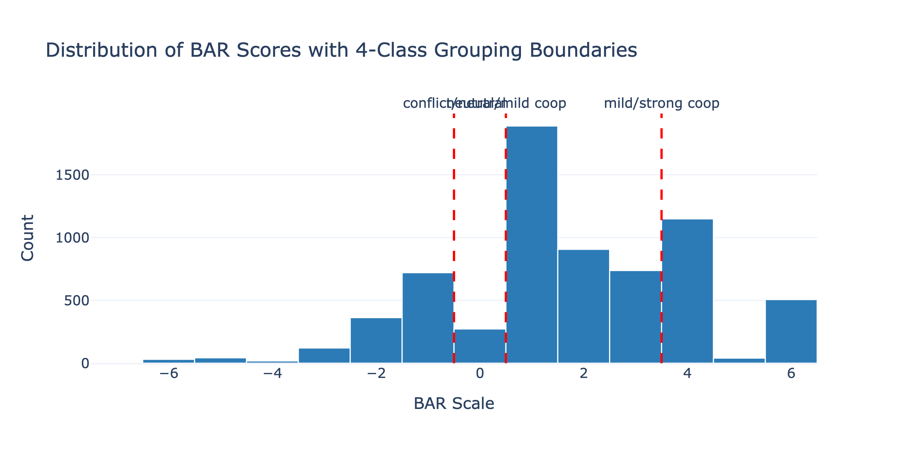{width=80%}

**Extended Data Figure 1.** Distribution of BAR scores across the full dataset with four-class ordinal grouping boundaries (dashed red lines). The neutral class (BAR = 0) contains only 4.0% of events.

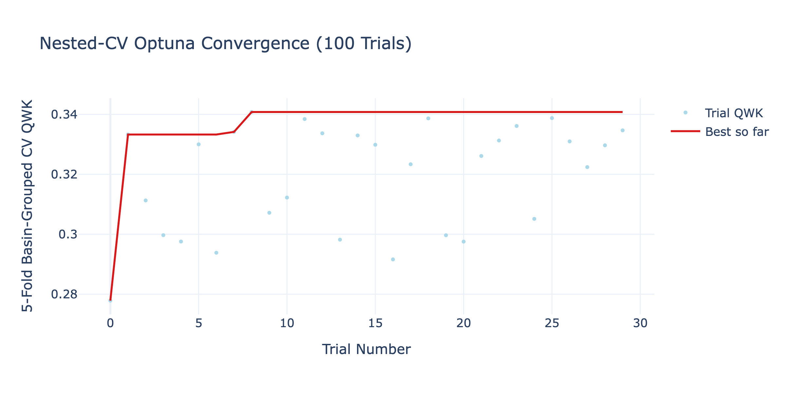{width=80%}

**Extended Data Figure 2.** Nested-CV Optuna convergence showing trial QWK versus trial number. The best-so-far line (red) plateaus after approximately 20 trials, suggesting the 100-trial budget was sufficient.

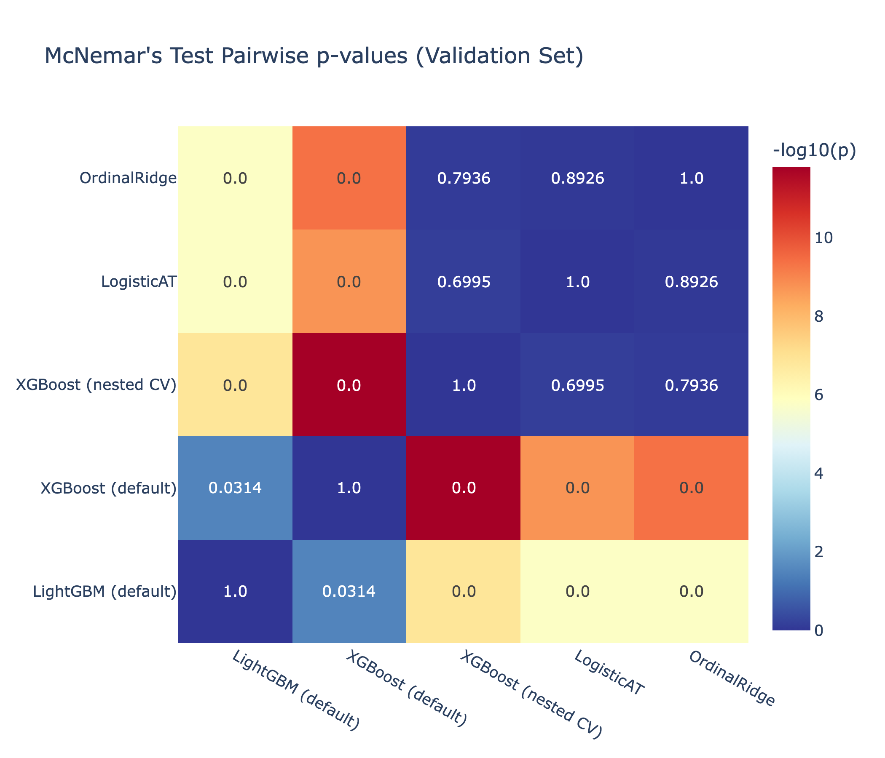{width=70%}

**Extended Data Figure 3.** McNemar's test pairwise p-value matrix for all model pairs on the validation set. Values shown are raw p-values; colour intensity encodes -log10(p).
